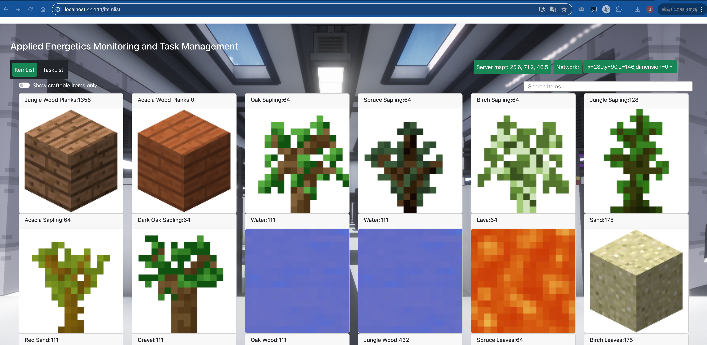
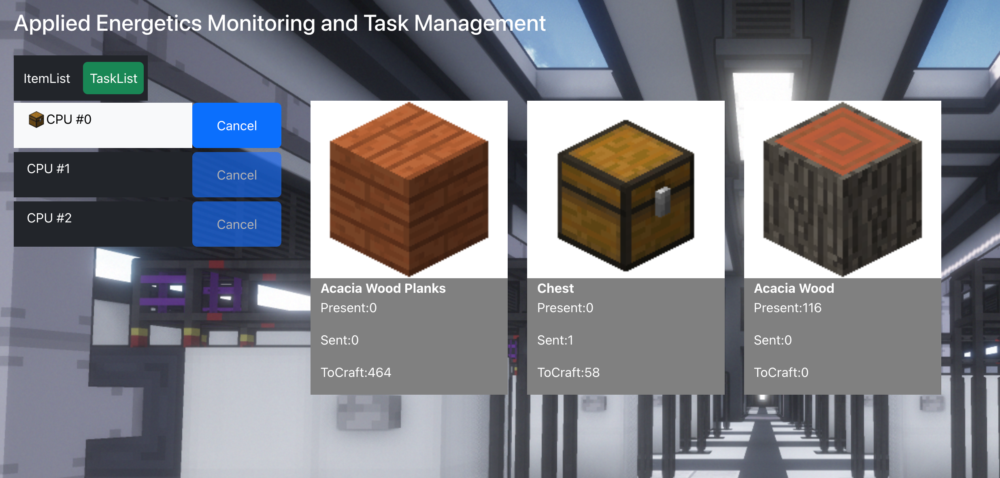

# Frontend of Applied Energetics Monitor Mod.

This project was bootstrapped with [Create React App](https://github.com/facebook/create-react-app).  
It aims to give player access of Applied Energetics, a mod of minecraft, on the web.  
Player can view items, submit crafts, monitor crafts and cancel crafts in the ME network in the game. 
This description may be not very clear, but definitely to those guys who plays modded Minecraft!   

# ScreenShots

